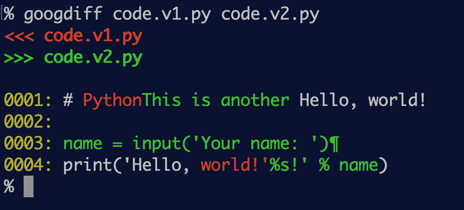
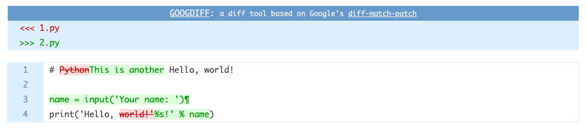
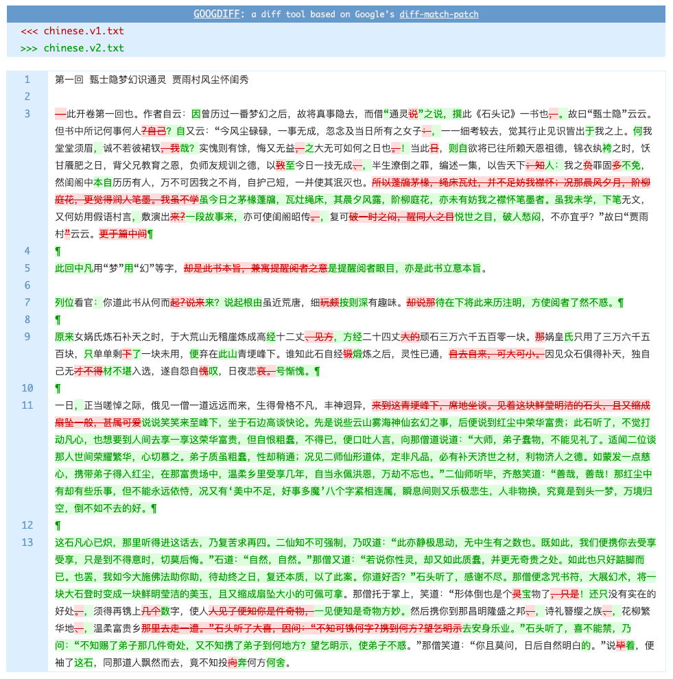

# googdiff: command-line diff tool, a wrapper of Google's diff-match-patch module.

See [the API doc of Google's diff-match-patch
module](https://github.com/google/diff-match-patch).

## Install googdiff with pip

```
pip install googdiff
```

## Usage

```
# Usage info
googdiff --help

# Show diffs in console mode:
googdiff file1 file2

# or:
googdiff -c file1 file2

# Show diffs in web browser:
googdiff -b file1 file2
```

## Git diff with googdiff

```
# in text mode:
git difftool -y --extcmd=googdiff

# or, in browser:
git difftool -y --extcmd='googdiff -b'
```

## Screenshots






